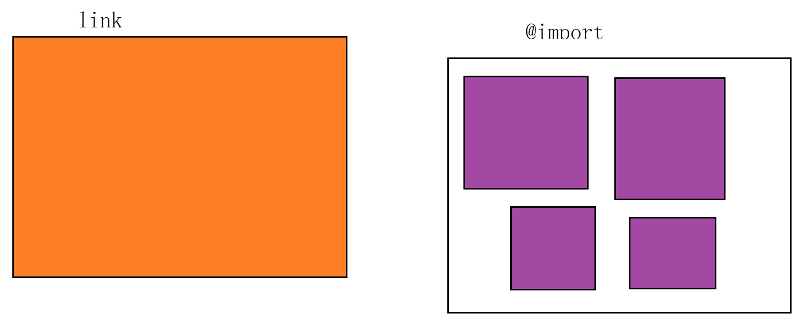

# css

##   1. 基本语法

### 1.1 标签

> - div：块级元素，换行
>
>
> - span： 内联元素，不换行
>
>
> - 标签学习：
>
>   1. > 文件标签：构成html最基本的标签
>      >
>      >   html:html文档的根标签
>      >   head：头标签。用于指定html文档的一些属性。引入外部的资源
>      >   title：标题标签。
>      >   body：体标签
>   2. >
>      > 文本标签：和文本有关的标签
>      > 注释：<!-- 注释内容 --> 
>      > h1~h6:字体大小逐渐递减
>      > p：段落标签
>   3. > 换行标签
>      > hr：展示一条水平线
>      >       属性：
>      >          color：颜色
>      >          width：宽度
>      >           size：高度
>      >          align：对其方式
>      >          center：居中
>      >          left：左对齐
>      >          right：右对齐
>   4. > 字体
>      > <b>：字体加粗
>      > <i>：字体斜体     
>      > <font>:字体标签    
>      >
>      > center:文本居中  
>      >    属性：  
>      >      color：颜色    
>      >      size：大小       
>      >      face：字体       

```html
div{ 
    /*
    选择器 { 属性:值; 
    		属性:值;  
    		属性:值;}
  	  选择器:将样式和页面元素关联起来的名称
   	  属性:希望设置的样式属性每个属性有一个或多个值。
    */
    width:100px; 
    height:100px; 
    color:red 

}
```

##  2. 样式引入

### 2.1 外联式

通过link标签，链接到外部样式表到页面中。

```html
<link rel="stylesheet" type="text/css" href="css/main.css">
```

### 2.2 嵌入式

通过style标签，在网页上创建嵌入的样式表。

```html
<style type="text/css">
    div{ width:100px; height:100px; color:red }
   ......
</style>
```

### 2.3 内联式

通过标签的style属性，在标签上直接写样式，行内：不推荐， 赶时间、应急。

```html
<div style="width:100px; height:100px; color:red ">......</div>
```

外部导入的两种方式（链接式,link； 导入式,@import）区别 ：

> - 推荐link
> - link属于xhtml规范； @import属于css2.1标准
> - link将css预先加载到网页中，再进行编译显示
> - @import：先显示网页结构，然后再加载CSS内容
> - @import是css2.1独有的




> 提示： 注释：html <!-- -->，在css中注释 /*  */
>
> ​			CSS优先级问题： 行内优先级 >外部 >内部
>

##  3. 选择器

### 3.1 标签选择器

标签选择器，此种选择器影响范围大，建议尽量应用在层级选择器中。
 举例：

```HTML
div{color:red}   
<div>....</div>   <!-- 对应以上两条样式 -->
```

### 3.2 id选择器

通过id名来选择元素，元素的id名称不能重复，一个样式设置项只能对应于页面上一个元素，id名一般给程序使用，所以不推荐使用id作为选择器。
 举例：

```HTML
#box{color:red} 
<div id="box">....</div>   <!-- 对应以上一条样式，其它元素不允许应用此样式 -->
```

### 3.3 类选择器

通过类名来选择元素，一个类可应用于多个元素，一个元素上也可以使用多个类，应用灵活，可复用，是css中应用最多的一种选择器。

```html
.red{color:red}
.big{font-size:20px}
.mt10{margin-top:10px}
<div class="red">....</div>
<h1 class="red big mt10">....</h1>
<p class="red mt10">....</p>
```

### 3.4 层级选择器

主要应用在选择父元素下的子元素，或者子元素下面的子元素，可与标签元素结合使用，减少命名，同时也可以通过层级，防止命名冲突。

```HTML
.box span{color:red}
.box .red{color:pink}
.red{color:red}

<div class="box">
    <span>....</span>
    <a href="#" class="red">....</a>
</div>
<h3 class="red">....<
```

### 3.5 组选择器

多个选择器，如果有同样的样式设置，可以使用组选择器。

```HTML
.box1,.box2,.box3{width:100px;height:100px}
.box1{background:red}
.box2{background:pink}
.box2{background:gold}

<div class="box1">....</div>
<div class="box2">....</div>
<div class="box3">....</div>
```

### 3.6 伪类及伪元素

​		伪类用于选择DOM树之外的信息，包含那些 匹配指定状态的元素 ，比如:visited，:active；或是 不能用简单选择器进行表示的信息 ，后者包含那些满足一定逻辑条件的DOM树中的元素，比如:first-child，:first-of-type，:target。

>  		状态类：link ， visited  ，hover ， active，focus
>    	 结构类： first-child , last-child , nth-child , nth-of-type
>    	 表单类： checked ， disabled
>    	 语言类： dir， lang

常用伪类:

> `:active 选择正在被激活的元素（匹配指定状态）`
> `:hover 选择被鼠标悬浮着的元素（匹配指定状态）`
> `:link 选择未被访问的元素 （匹配指定状态）`
> `:visited 选择已被访问的元素（匹配指定状态）`
> -------上面四种定义的时候需要保证这样的顺序-----------
>
> 带有type伪类选择器：
>      选择其父类元素下指定类型的元素
>       :first-of-type 选中该元素是别人首个子元素，例如p:first-of-type  就是所以元素子元素中第一个p元素
>       :nth-of-type （odd奇数,event偶数） 例如p:nth-of-type(2) 代表子元素中第二次出现的p元素  n从1开始算
>       :nth-last-of-type 意义和上面类似，只不过是从尾部往前数，n从1开始算
>       :last-of-type 选中该元素,代表最后一个
>       :only-of-type  代表所有元素中只有一个该类型的元素p:only-of-type
> 
>带有child伪类选择器：
>      type类型的选择器只会计算指定类型选择器，而child无论什么类型都会计算在内。
>           :first-child 例如p:first-child 代表是父元素中的第一个元素，且类型为p
>           :nth-child(n) 例如p:nth-child(2) 表示选择子元素第二个且类型为p的元素，n从1开始算
>           :nth-last-child(n) 意思和上面类似，只不过是从结尾开始往前数第n个，n是从1开始算
>           :last-child 意义同上，最后一个元素
>           :only-child  例如p:only-child 代表子元素中只有一个元素，且必须是该类型p
>    
>其他伪类选择器：
>        :empty 选择没有子元素的元素执行样式
>           :target    锚点跳转到的内容执行样式
>           :root    匹配文档的根元素。html中默认就是html元素
>           :enabled  选择表单元素具有非disable属性的元素，执行样式
>           :disabled  选择表单元素具有disable属性的元素。执行样式
>           :checked  单选按钮或者多选按钮被选中的，执行样式
>           :not 例如 :not(p) 匹配非p元素
>       :default 默认状态的表单元素，比如默认选中的下拉框，单选按钮，多选按钮，执行样式
> 		:lang   lang(en) 对应html上的lang属性，符合的话执行样式
>    		:focus  当前元素为focus状态
>    **注意：**
>    
>    p:first-child，表示选择的元素既要是p标签，又要是其父元素的第一个子元素，不要错认为是表示p元素的第一个子元素；
>    同理，p:first-of-type表示选择的元素既要是p标签，又要是其父元素的第一个p标签元素。

​		伪元素为DOM树没有定义的虚拟元素。不同于其他选择器，它不以元素为最小选择单元，它选择的是元素指定内容。比如::before表示选择元素内容的之前内容，也就是""；::selection表示选择元素被选中的内容。

常用伪元素:

> ::first-letter 选择指定元素的第一个单词  
> ::first-line 选择指定元素的第一行
> `::after 在指定元素的内容前面插入内容`
> `::before 在指定元素的内容后面插入内容 `添加文字,图片,声音{ context:""},{context:url("./1.jpg")}
> :selection 选择指定元素中被用户选中的内容

常用的伪类选择器有hover，表示鼠标悬浮在元素上时的状态，伪元素选择器有before和after,它们可以通过样式在元素中插入内容。

```HTML
.box1:hover{color:red}
.box2:before{content:'行首文字';}
.box3:after{content:'行尾文字';}

<div class="box1">....</div>
<div class="box2">....</div>
<div class="box3">....</div>
```

##  4. 文本设置

### 4.1 字体样式：

> +  color 设文字的颜色，如： color:red;
>+  font-size 设置文字的**大小**，如：font-size:12px;
> +  font-family 设置文字的**字体**，如：font-family:'微软雅黑';
>+  font-style 设置字体是否**倾斜**，如：font-style:'normal'; 设置不倾斜，font-style:'italic';设置文字倾斜
> +  font-weight 设置文字是否**加粗**，如：font-weight:bold; 设置加粗 font-weight:normal 设置不加粗
>+  line-height 设置文字的**行高**，设置行高相当于在每行文字的上下同时加间距， 如：line-height:24px;
> +  ·font 同时设置文字的几个属性，写的顺序有兼容问题，建议按照如下顺序写： 
>+  font：是否加粗 大小/行高 字体；如： font:  normal  12px/36px   '微软雅黑';
> +  text-decoration 文字的**下划线**，如：text-decoration:none; 将文字下划线去掉
>+  text-indent 文字**首行缩进**，如：text-indent:24px; 设置文字首行缩进24px
> +  text-align 文字**对齐方式**，如text-align:center 设置文字水平居中

**添加文字**

-  https://icomoon.io/#

- https://www.iconfont.cn/

  `引入后font-family:'..最后添加字体..';`

###  4.2 颜色表示

颜色值主要有三种表示方法：

> 1. 颜色名表示，比如：red 红色，gold 金色
>
> 2. rgb表示，比如：rgb(255,0,0)表示红色
>
> 3. 16进制数值表示，比如：#ff0000 表示红色，这种可以简写成 #f00
>
> 4. 阴影text-shadow: 横坐标 纵坐标 发散程度
>
>    a:hover 悬浮
>
>    a:link 未访问
>
>    a:visited 已经访问过了
>
>    a:active 点击鼠标时
>
>    设置的顺序： link -> visitied > hover > active

##  5. 盒子模型

### 5.1 盒子模型解释 

把元素叫做盒子，设置对应的样式分别为：盒子的宽度(width)、盒子的高度(height)、盒子的边框(border)、盒子内的内容和边框之间的间距(padding)、盒子与盒子之间的间距(margin)。


**设置宽高**

```HTML
width:200px;  /* 设置盒子的宽度，此宽度是指盒子内容的宽度，不是盒子整体宽度(难点) */ 
height:200px; /* 设置盒子的高度，此高度是指盒子内容的高度，不是盒子整体高度(难点) */
```

### 5.2 边框border

    border-top-color:red;    /* 设置顶部边框颜色为红色 */  
    border-top-width:10px;   /* 设置顶部边框粗细为10px */   
    border-top-style:solid;  /* 设置顶部边框的线性为实线，常用的有：solid(实线)  dashed(虚线)  dotted(点线); */

上面三句可以简写成一句：

    border-top:10px solid red;

设置其它三个边的方法和上面一样，把上面的'top'换成'left'就是设置左边，换成'right'就是设置右边，换成'bottom'就是设置底边。

四个边如果设置一样，可以将四个边的设置合并成一句：

    border:10px solid red;

### 5.3 内间距padding

设置盒子四边的内间距，可设置如下：

    padding-top：20px;     /* 设置顶部内间距20px */ 
    padding-left:30px;     /* 设置左边内间距30px */ 
    padding-right:40px;    /* 设置右边内间距40px */ 
    padding-bottom:50px;   /* 设置底部内间距50px */

上面的设置可以简写如下：

     /* 四个值按照顺时针方向，分别设置的是 上 右 下 左  四个方向的内边距值。 */
     padding：20px 40px 50px 30px;

padding后面还可以跟3个值，2个值和1个值，它们分别设置的项目如下：

    padding：20px 40px 50px; /* 设置顶部内边距为20px，左右内边距为40px，底部内边距为50px */ 
    padding：20px 40px; /* 设置上下内边距为20px，左右内边距为40px*/ 
    padding：20px; /* 设置四边内边距为20px */

###  5.3 外间距margin

外边距的设置方法和padding的设置方法相同，将上面设置项中的'padding'换成'margin'就是外边距设置方法。

```html
<!DOCTYPE html>
<html lang="en">
<title>盒子的真实尺寸</title>
    <style type="text/css">   
    .box01{width:50px;height:50px;background-color:gold;} 
    .box02{width:50px;height:50px;background-color:gold;border:50px solid #000}
    .box03{width:50px;height:50px;background-color:gold;border:50px solid #000;padding: 50px;}
  </style>
</head>
<body>
    <div class="box01">--1---</div>
  <br />
    <div class="box02">--2---</div>
  <br />
    <div class="box03">--3--</div>
</body>
</html>
```


通过上面的页面得出结论：盒子的width和height设置的是盒子内容的宽和高，不是盒子本身的宽和高，盒子的真实尺寸计算公式如下：

- 盒子宽度 = width + padding左右 + border左右

- 盒子高度 = height + padding上下 + border上下

### 5.4 相关问题

> margin相关技巧
> 1、设置元素水平居中： margin:x auto;
> 2、margin负值让元素位移及边框合并

**外边距合并**

外边距合并指的是，当两个垂直外边距相遇时，它们将形成一个外边距。合并后的外边距的高度等于两个发生合并的外边距的高度中的较大者。

**margin-top 塌陷（相邻块元素垂直外边距的合并）**

> 当上下相邻的两个块元素相遇时，如果上面的元素有下外边距margin-bottom，下面的元素有上外边距margin-top，则他们之间的垂直间距不是margin-bottom与margin-top之和，而是两者中的较大者。这种现象被称为相邻块元素垂直外边距的合并（也称外边距塌陷）。在两个盒子嵌套时候，内部的盒子设置的margin-top会加到外边的盒子上，导致内部的盒子margin-top设置失败。

解决方法;

> 1. 使用这种特性
> 2. 设置一边的外边距，一般设置margin-top
> 3. 将元素浮动或者定位

**margin-top 塌陷（嵌套块元素垂直外边距的合并）**

> 对于两个嵌套关系的块元素，如果父元素没有上内边距及边框，则父元素的上外边距会与子元素的上外边距发生合并，合并后的外边距为两者中的较大者，即使父元素的上外边距为0，也会发生合并。设置子元素的外边距时，会应用到父边距上去 ***\*垂直方向才会发生合并现象\****

解决方法如下：

> 1. 外部盒子设置一个边框
> 2. 外部盒子设置 overflow:hidden
> 3. 使用伪元素类：


## 6. 元素溢出

当子元素的尺寸超过父元素的尺寸时，需要设置父元素显示溢出的子元素的方式，

设置的方法是通过overflow属性来设置。

> overflow: visible  | hidden  |scroll |auto;

overflow的设置项:

> 1. visible 默认值。内容不会被修剪，会呈现在元素框之外。
>
> 2. hidden 内容会被修剪，并且其余内容是不可见的，此属性还有清除浮动、清除margin-top塌陷的功能。
>
> 3. scroll 内容会被修剪，但是浏览器会显示滚动条以便查看其余的内容。
>
> 4. auto 如果内容被修剪，则浏览器会显示滚动条以便查看其余的内容。5、inherit 规定应该从父元素继承 overflow 属性的值。

## 7. 浮动

### 浮动特性

块级元素 -> 内敛元素 ：将不同行的元素放置到一行

浮动 ：将不同行的元素放置到一行

float: none | left | right

> 1. 浮动元素有左浮动(float:left)和右浮动(float:right)两种
> 2. 浮动的元素会向左或向右浮动，碰到父元素边界、其他元素才停下来
> 3. 相邻浮动的块元素可以并在一行，超出父级宽度就换行
>
> 4. 浮动让行内元素或块元素自动转化为行内块元素(此时不会有行内块元素间隙问题)
>
> 5. 浮动元素后面没有浮动的元素会占据浮动元素的位置，没有浮动的元素内的文字会避开浮动的元素，形成文字饶图的效果
> 6. 父元素如果没有设置尺寸(一般是高度不设置)，父元素内整体浮动的元素无法撑开父元素，父元素需要清除浮动
>
> 7. 浮动元素之间没有垂直margin的合并

### 清除浮动

浮动（压缩）：压缩的是**自己**的空间

clear: 清除浮动（清除一半，还原了 块级元素的 换行特性，但没有还原空间）

clear:清除的是上一个元素（不是自己）

clear:left | right |both

> -    `父级上增加属性overflow：hidden`
>
> -    `在最后一个子元素的后面加一个空的div，给它样式属性 clear:both（不推荐）`
>
> -    `使用成熟的清浮动样式类，clearfix`
>
> -    `.clearfix:after,.clearfix:before{ content: "";display: table;}`
>
> -    `.clearfix:after{ clear:both;}`
>
> -    `.clearfix{zoom:1;}`

##8. 定位

### 1.8.1文档流 

 *文档流，是指盒子按照html标签编写的顺序依次从上到下，从左到右排列，块元素占一行，行内元素在一行之内从左到右排列，先写的先排列，后写的排在后面，每个盒子都占据自己的位置。*

> - 块级元素（block level）：自带换行 div ，可以设置宽和高
>
> - 内联元素 (inline level) ：不换行  span, a  ，没有宽和高   （内敛元素不遵守盒子模型）
>
> - inline-block：
>
>   ​				1.如果inline失效，可以尝试inline-block
>
>   ​				2.可以设置宽和高
>
> - 块级元素可以包含内敛，反之不行。

 **1.8.2 块元素**

元素就是标签，布局中常用的有三种标签，块元素、内联元素、内联块元素。
 块元素，也可以称为行元素，布局中常用的标签如：div、p、ul、li、h1~h6、dl、dt、dd等等都是块元素，它在布局中的行为：

> - 支持全部的样式
> - 如果没有设置宽度，默认的宽度为父级宽度100%
> - ·盒子占据一行、即使设置了宽度

**1.8.3 内联元素**
 内联元素，也可以称为行内元素，布局中常用的标签如：a、span、em、b、strong、i等等都是内联元素，它们在布局中的行为：

> -   支持部分样式（不支持宽、高、margin上下、padding上下）
> -   宽高由内容决定
> -   盒子并在一行
> -   代码换行，盒子之间会产生间距
> -   子元素是内联元素，父元素可以用text-align属性设置子元素水平对齐方式

> 解决内联元素间隙的方法 
> 1、去掉内联元素之间的换行
> 2、将内联元素的父级设置font-size为0，内联元素自身再设置font-size

**1.8.4 内联块元素**
 内联块元素，也叫行内块元素，是新增的元素类型，现有元素没有归于此类别的，img和input元素的行为类似这种元素，但是也归类于内联元素，我们可以用display属性将块元素或者内联元素转化成这种元素。它们在布局中表现的行为：

> -   支持全部样式
> -   如果没有设置宽高，宽高由内容决定
> -   盒子并在一行
> -   代码换行，盒子会产生间距
> -   子元素是内联块元素，父元素可以用text-align属性设置子元素水平对齐方式。

这三种元素，可以通过display属性来相互转化，不过实际开发中，块元素用得比较多，所以我们经常把内联元素转化为块元素，少量转化为内联块，而要使用内联元素时，直接使用内联元素，而不用块元素转化了。

### 1.8.5 display属性

> display属性是用来设置元素的类型及隐藏的，常用的属性有：
>
> - none 元素隐藏且不占位置
> - block 元素以块元素显示,容器类型的元素基本是这个值,有`<div>`，`<h1>`到`<h6>`，`<p>`，`<form>`，`<header>`，`<footer>`，`<section>`，`<article>`
> - inline 元素以内联元素显示,最典型的是`<span>`，还有`<a>`，``，以及古代`html`语言当中的`<b>`，`<i>`都属于这一类型
> - inline-block 元素以内联块元素显示
>

> display: none 
>
> - 将元素与其子元素从普通文档流中移除。这时文档的渲染就像元素从来没有存在过一样，也就是说它所占据的空间消失了。元素的内容也会消失。
>
> display: block
>
>
> -  block元素会独占一行，多个block元素会各自新起一行。默认情况下，block元素宽度自动填满其父元素宽度；
> -  block元素可以设置margin和padding属性；
> -  block元素可以设置width、height属性。
> -  块级元素即使设置了宽度，仍然是独占一行。块级元素在设置宽度的情况下，是通过自定义margin-right来自动填满一行，这个时候你设置margin-right是无效的；块级元素在没有设置宽度的时候，margin-right会生效，块级元素的width通过自定义在自动填满一行。
>
> display: inline 
>
> - inline元素不会独占一行，多个相邻的行内元素会排列在同一行里，直到一行排列不下，才会新换一行，其宽度随元素的内容而变化；
> - inline元素设置width、height属性无效；
> - inline元素的margin和padding属性，水平方向的padding-left、padding-right、margin-left、margin-right都产生边距效果；但竖直方向的padding-top、padding-bottom、margin-top、margin-bottom不会产生边距效果。
>
> display:inline 
>
> - 将对象呈现为inline对象，但是对象的内容作为block对象呈现，之后的内联对象会被排列在同一行内。就是集合了block和inline的全部优点。width、height、margin、padding设置都会生效。

## 9. 定位 

> position: static(默认值，没有定位) | relative(相对定位) | absolute(绝对定位) |fixed（固定定位，个别版本浏览器不支持）
>
> relative：相对于自身
>
> 注意位置：left是指往右便宜；top是下；其他同理

 我们可以使用css的position属性来设置元素的定位类型，postion的设置项如下：

> - **relative** 相对定位，**相对于自身定位元素**,所占据的文档流的位置保留，元素本身相对自身原位置进行偏移。
> - **absolute** 绝对定位，元素脱离文档流，**如果有已定位的祖先：参照祖先**。不占据文档流的位置，可以理解为漂浮在文档流的上方，相对于父级元素来进行定位，如果找不到，则相对于body元素进行定位。
> - **fixed** 生成固定定位元素，元素脱离文档流，不占据文档流的位置，可以理解为漂浮在文档流的上方，相对于**浏览器窗口**进行定位。
> - static 默认值，没有定位，元素出现在正常的文档流中，相当于取消定位属性或者不设置定位属性。
>
> - inherit 从父元素继承 position 属性的值。

绝对定位：

> position: absolute
>
> 是否存在 “已经定位的祖先元素”
>
> - 存在 ：则参照 “已经定位的祖先元素”定位
> - 不存在： 则参照浏览器定位
>
> 绝对定位：会脱离文档流（释放空间，会让网页无法识别）

```
	div
		{
			width:100px ;
			height:100px ;
			background: yellow ;		
			position:absolute ;
			right :30px ;
			bottom: 30px ;	 
		}
```


### 1.9.1 定位偏移 

 定位的元素还需要用left、right、top或者bottom来设置相对于参照元素的偏移值。

定位元素层级 
 定位元素是浮动的正常的文档流之上的，可以用z-index属性来设置元素的层级

伪代码如下:

    .box01{
        ......
        position:absolute;  /* 设置了绝对定位 */
        left:200px;            /* 相对于参照元素左边向右偏移200px */
        top:100px;          /* 相对于参照元素顶部向下偏移100px */
        z-index:10          /* 将元素层级设置为10 */
    }

**定位元素特性** 
 绝对定位和固定定位的块元素和行内元素会自动转化为行内块元素

### 1.9.2background属性 

 background属性是css中应用比较多，且比较重要的一个属性，它是负责给盒子设置背景图片和背景颜色的，background是一个复合属性，它可以分解成如下几个设置项：

> ​    background-color 设置背景颜色
>
> ​    background-image 设置背景图片地址
>
> ​    background-repeat 设置背景图片如何重复平铺
>
> ​    background-position 设置背景图片的位置
>
> ​    background-attachment 设置背景图片是固定还是随着页面滚动条滚动

实际应用中，我们可以用background属性将上面所有的设置项放在一起，而且也建议这么做，这样做性能更高，而且兼容性更好，

> 比如：“background: #**00FF00 `url(bgimage.gif)` no-repeat `left center` fixed**”，这里面的“#00ff00”是设置background-color；
>
> - `“url(bgimage.gif)`”是设置background-image；
> - “`no-repeat`”是设置background-repeat；
> - “`left center`”是设置background-position；
> - “`fixed`”是设置background-attachment，各个设置项用空格隔开，有的设置项不写也是可以的，它会使用默认值。

例子说明：

> background-position的设置，`可以在水平方向设置“left”、“center”、“right”，`
>
> ​												`在垂直方向设置“top”、“center”、“bottom”，`
>
> 除了设置这些方位词之外，还可以设置具体的数值。

实现效果设置为：

> “background:url(location_bg.jpg) -110px -150px”，
>
> 第一个数值表示背景图相对于自己的左上角向左偏移110px，负值向左，正值向右，
>
> 第二个数值表示背景图相对于自己的左上角向上偏移150px，负值向上，正值向下。
>
> 透明度：
>
> - opacity:0.5
>
> - filter:alpha(opacity=50)
>
> 浏览器兼容性问题，部分浏览器支持opacity，部分支持filter:alpha(opacity=50) 


实现原理示意图

```html
<!DOCTYPE html>
<html lang="en">
<head>
	  <meta charset="UTF-8">
      <title>test background</title>
    <style type="text/css">
        .backshow{
          width:320px;
          height:160px
          border:3px solid #333;
          float:left;
          margin:10px;      
        }    
        .bg{width:94px;
          height:94px;
          border:3px solid #666;
          background:url(location_bg.jpg) -110px -150px;
        }
  </style>
</head>
<div class="bg"></div>
</body>
</html>
```

## 10.  CSS权重

CSS权重指的是样式的优先级，有两条或多条样式作用于一个元素，权重高的那条样式对元素起作用,权重相同的，后写的样式会覆盖前面写的样式。

**权重的等级**

可以把样式的应用方式分为几个等级，按照等级来计算权重

> + !important，加在样式属性值后，权重值为 10000
>
> + 内联样式，如：style=””，权重值为1000 ID选择器，如：#content，权重值为100类，伪类和属性选择器，如： content、:hover 权重值为10
>
> + 标签选择器和伪元素选择器，如：div、p、:before 权重值为1
>
> + 通用选择器（*）、子选择器（>）、相邻选择器（+）、同胞选择器（~）、权重值为0

**权重的计算实例**

1、实例一：

```HTML
<style type="text/css">
    div{
        color:red !important;
    }        
</style>
......
<div style="color:blue">这是一个div元素</div>
<!-- 
两条样式同时作用一个div，上面的样式权重值为10000+1，下面的行间样式的权重值为1000，
所以文字的最终颜色为red 
-->
```

2、实例二：

```HTML
<style type="text/css">
    #content div.main_content h2{
        color:red;    
    }
    #content .main_content h2{
        color:blue;
    }
</style>
......
<div id="content">
    <div class="main_content">
        <h2>这是一个h2标题</h2>
    </div>
</div>
<!-- 
第一条样式的权重计算： 100+1+10+1，结果为112；
第二条样式的权重计算： 100+10+1，结果为111；
h2标题的最终颜色为red
-->
```

**CSS3新增选择器**

> 1、E:nth-child(n)：匹配元素类型为E且是父元素的第n个子元素
>
> 2、E:first-child：匹配元素类型为E且是父元素的第一个子元素
>
> 3、E:last-child：匹配元素类型为E且是父元素的最后一个子元素
>
> 4、E > F E元素下面第一层子集
>
> 5、E ~ F E元素后面的兄弟元素
>
> 6、E + F 紧挨着的后面的兄弟元素

```html
<style type="text/css">            

    .list div:nth-child(2){
        background-color:red;
    }
</style>
......
<div class="list">
    <h2>1</h2>
    <div>2</div>
    <div>3</div>
    <div>4</div>
    <div>5</div>
</div>
```

**属性选择器：**
 1、E[attr] 含有attr属性的元素

```html
<style type="text/css">
    div[data-attr='ok']{
        color:red;
    }
</style>
......
<div data-attr="ok">这是一个div元素</div>
```

2、E[attr='ok'] 含有attr属性的元素且它的值为“ok”
 3、E[attr^='ok'] 含有attr属性的元素且它的值的开头含有“ok”
 4、E[attr$='ok'] 含有attr属性的元素且它的值的结尾含有“ok”
 5、E[attr*='ok'] 含有attr属性的元素且它的值中含有“ok”

## 11. flex布局

flex 是 flexible 的缩写，意思为弹性布局，用来为盒模型提供最大的灵活性。

```
div {
	display: flex
	// 开启弹性布局 ，元素设置 flex 属性后，其具有的 float clear vertical-align 都将失效。}
```

常规布局：

- 块级元素自上而下排列
- 元素只有高度，没有宽度时，宽度默认100%
- 元素只有宽度，没有高度时，高度为 0

flex 布局

- 容器内元素默认从左往右排列
- 元素只有高度，没有宽度时，宽度为 0
- 元素只有宽度，没有高度时，高度默认100%

flex 容器的元素默认有两条轴：水平主轴（main axis）和垂直交叉轴(cross axis)，单个项目占据的主轴空间称为 main size，交叉轴为 cross size


存在flex container上css属性

> 1. align-content 控制多根轴线的对齐方式。如果项目只有一根轴线，该属性不起作用。属性包含  flex-start | flex-end | center | space-between | space-around | stretch
> 2. justify-content 控制在主轴上的对齐方式。属性包含 flex-start | flex-end | center | space-between | space-around
> 3. align-items 控制交叉轴上如何对齐。包含的属性有 flex-start | flex-end | center | baseline | stretch
> 4. flex-direction 改变主轴的方向，默认为 row 横向排列。属性包含 row  | row-reverse  |  column  | column-reverse
> 5. flex-wrap 控制元素换行。属性包含 nowrap | wrap | wrap-reverse
> 6. flex-flow 属性是flex-direction属性和flex-wrap属性的简写形

存在flex items上的css属性

> - align-self 属性允许单个项目有与其他项目不一样的对齐方式。包含的属性 auto | flex-start | flex-end | center | baseline | stretch
> - order 属性控制元素的排列顺序，数值越小，排列越靠前。
> - flex-grow 属性定义项目的放大比例，默认为0，即如果存在剩余空间，也不放大。
> - flex-shrink 属性定义了项目的缩小比例，默认为1，即如果空间不足，该项目将缩小。
> - flex-basis 属性定义了项目占据主轴的空间，默认为 auto ，即元素本来大小。
> - flex 属性是 flex-grow, flex-shrink 和 flex-basis 的简写，默认值为0 1 auto

## 12. 网页适配

### 12.1 rem


### 12.2 媒体查询

### 12.3 less


### 12.4 适配两种方案


 flexible： https://github.com/amfe/lib-flexible

vscode px转换rem插件 cssrem

## 13. CSS3

**CSS3圆角**

> 设置某一个角的圆角，比如设置左上角的圆角：border-top-left-radius:30px 60px;
>
> 同时分别设置四个角： border-radius:30px 60px 120px 150px;
>
> 设置四个圆角相同：border-radius:50%;

**rgba（新的颜色值表示法）**

1、盒子透明度表示法：

        .box
        {
            opacity:0.1;
            /* 兼容IE */
           filter:alpha(opacity=10); 
        }

2、rgba(0,0,0,0.1) 前三个数值表示颜色，第四个数值表示颜色的透明度

### CSS3 transition动画

> 1、transition-property 设置过渡的属性，比如：width height background-color
> 2、transition-duration 设置过渡的时间，比如：1s 500ms
> 3、transition-timing-function 设置过渡的运动方式，常用有 linear(匀速)|ease(缓冲运动)
> 4、transition-delay 设置动画的延迟
> 5、transition: property duration timing-function delay 同时设置四个属性

###CSS3 transform变换

> 1、translate(x,y)  平移
> 2、scale(x,y) 设置盒子缩放
> 3、rotate(顺时针度数deg) 设置盒子旋转
>
> 4、skew(x-angle,y-angle) 设置盒子斜切
> 5、perspective 设置透视距离
> 6、transform-style flat | preserve-3d 设置盒子是否按3d空间显示
> 7、translateX、translateY、translateZ 设置三维移动
> 8、rotateX、rotateY、rotateZ 设置三维旋转
> 9、scaleX、scaleY、scaleZ 设置三维缩放
> 10、tranform-origin 设置变形的中心点
> 11、backface-visibility 设置盒子背面是否可见

举例：（翻面效果）

```HTML
<!DOCTYPE html>
<html lang="en">

<head>
    <meta charset="UTF-8">
    <title>翻面</title>
    <style type="text/css">
        .box{
            width:300px;
            height:272px;
            margin:50px auto 0;
            transform-style:preserve-3d;
            position:relative;            
        }
        .box .pic{
            width:300px;
            height:272px;
            position:absolute;
            background-color:cyan;
            left:0;
            top:0;
            transform:perspective(800px) rotateY(0deg);
            backface-visibility:hidden;
            transition:all 500ms ease;
        }
        .box .back_info{
            width:300px;
            height:272px;
            text-align:center;
            line-height:272px;
            background-color:gold;
            position:absolute;
            left:0;
            top:0;
            transform:rotateY(180deg);
            backface-visibility:hidden;
            transition:all 500ms ease;            
        }
        .box:hover .pic{
            transform:perspective(800px) rotateY(180deg);
        }
        .box:hover .back_info{
            transform:perspective(800px) rotateY(0deg);
        }
    </style>
</head>
<body>
    <div class="box">        
        <div class="pic"></div>
        <div class="back_info">背面文字说明</div>
    </div>
</body>

</html>
```

### CSS3 animation动画

> 1、@keyframes 定义关键帧动画
> 2、animation-name 动画名称
> 3、animation-duration 动画时间
> 4、animation-timing-function 动画曲线 linear(匀速)|ease(缓冲)|steps(步数)
> 5、animation-delay 动画延迟
> 6、animation-iteration-count 动画播放次数 n|infinite
> 7、animation-direction 动画结束后是否反向还原 normal|alternate
> 8、animation-play-state 动画状态 paused(停止)|running(运动)
> 9、animation-fill-mode 动画前后的状态 none(缺省)|forwards(结束时停留在最后一帧)|backwards(开始时停留在定义的开始帧)|both(前后都应用)
> 10、animation:name duration timing-function delay iteration-count direction;同时设置多个属性

### 滤镜fiter

### calc函数

### CSS3 浏览器前缀

为了让CSS3样式兼容，过渡浏览器，需要将某些样式加上浏览器前缀：

			- IE9兼容IE浏览器 -ms-
			- 兼容: -moz-
			- 兼容/safari:  -webkit-
			- 兼容: -o- 

如果有@，则兼容性前缀增加到@的后面，新浏览器一般都支持。

> @-webkit-keyframes x

比如：

```HTML
div
{    
    -ms-transform: rotate(30deg);        
    -webkit-transform: rotate(30deg);    
    -o-transform: rotate(30deg);        
    -moz-transform: rotate(30deg);    
    transform: rotate(30deg);
}
```

