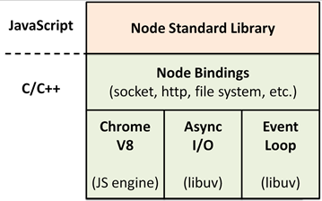
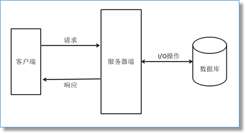

# node.js

## 1.  Nodejs简介

Node.js 是一个基于 Chrome V8 引擎的 JavaScript 运行环境。




### 1.1 node优缺点
> 优点：
> 	异步非阻塞的I/O（I/O线程池）
> 	特别适用于I/O密集型应用
> 	事件循环机制
> 	单线程（成也单线程，败也单线程）
> 	跨平台

简单web交互模型：



> 缺点：
> 	回调函数嵌套太多、太深（俗称回调地狱）
> 	单线程，处理不好CPU 密集型任务

### 1.2 应用场景

> Web服务API，比如RESTful API（本身没有太多的逻辑,只需要请求API，组织数据进行返回即可）
> 服务器渲染页面，提升速度
> 后端的Web服务，例如跨域、服务器端的请求

## 2. 模块化

模块化指的就是将一个大的功能拆分为一个一个小的模块，通过不同的模块的组合来实现一个大功能。Node中使用的是CommonJS规范来实现的模块化，前端使用的模块化规范是AMD和CMD

### 2.1 CommonJS

CommonJS 是一套模块化规范，它包含：模块、二进制、Buffer、字符集编码、I/O流、进程环境、文件系统、套接字、单元测试、Web服务器网关接口、包管理等。Node借鉴了commonjs的规范实现了一套模块系统，我们也叫做commonJS模块化系统。

### 2.2 模块引用

1. 通过require()函数来引入外部的模块
2. 它需要一个模块的标识作为参数，返回一个对象表示引入的模块

> **var** a = require(**"../a"**);
>  **var** math = require(**"math"**);

### 2.3 模块标识

1. 引入外部模块时，需要通过模块的标识进行引入

2. 对于自定义的文件模块，模块的标识就是文件的路径（绝对路径、以 . 或 .. 开头的相对路径）

   ​	例子："./a" "../b"

3. 对于下载的模块或系统模块模块的标识就是文件的名字

​           例子："fs" "express"

### 2.4 exports暴露模块

exports变量是对module的exports属性的引用，我们在向exports中添加属性时，本质上是在向module.exports中添加属性。module.exports 可以直接通过赋值的形式来暴露内容。exports 不能直接赋值，只能通过.的形式添加属性。

- 如果是简单的暴露属性，使用exports就好，引入模块使用方式： m1.属性名

- 如果需要向外暴露一个构造函，使用module.exports， 引入模块使用方式：m1


### 2.5 node中的函数

通过arguments.calle.toString()可以看到一个函数：
function (exports, require, module, __filename, __dirname) {}
这个函数是所有模块都有的，node编译时往其中注入5个参数：

> exports      暴露模块
> require       引入模块
> module       exports属性暴露模块
> __filename   文件的绝对路径
>
> __dirname    文件夹的绝对路径

### 2.6 Node引入模块的流程

#### 2.6.1路径分析

> - 核心模块：在Node源码编译就完成了，直接被加进内存中，如（http fs path)。
>
>   **具体的常用的知识点有:**
>
>   https://www.cnblogs.com/pengdt/p/12072506.html
>
>   - global全局
>   - buffer二进制
>   - console控制台
>   - crypto加密
>   - events事件
>   - module模块
>   - http
>   - path
>   - fs文件
>   - 计时器
>   - url
>   - zlib压缩
>   - querystring
>
> - 路径形式的文件模块：以”./” “../”路径形式的文件模块，转化为真实路径，按照索引去查找。
>
> - 第三方模块：它会从文件的node_modules逐层往上找，直到根目录的node_modules。
>

####2.6.2 文件定位

require()中的文件，如果没有后缀名，会以.js .json .node次序补充扩展名，依次尝试。

> - .js  fs模块同步读取文件编译执行
>
> - .json fs模块同步读取文件，用JSON.parse()解析返回结果
>
> - .node 这是c/c++编写的扩展文件，通过dlopen()方法编译
>
> - 其他扩展名 会以.js文件载入
>

## 3. 包和包管理器

### 3.1 package管理器

Node.js的包基本遵循CommonJS规范，包将一组相关的模块组合在一起，形成一组完整的工具。

包由包结构和包描述文件两个部分组成。

> 包结构：用于组织包中的各种文件
>
> 包描述文件：描述包的相关信息，以供外部读取分析
>

#### 3.1.1包结构

包实际上就是一个压缩文件，解压以后还原为目录。符合CommonJS规范的目录，应该包含如下文件和文件夹：

> - package.json  描述文件
> - bin  可执行二进制文件
> - lib  js代码
> - doc 文档
> - test 单元测试
>

#### 3.1.2包描述文件

包描述文件用于表达非代码相关的信息，它是一个JSON格式的文件：package.json

包描述文件包含以下字段：name、version、description、keywords、maintainers、contributors、bugs、licenses、repositories、dependencies、homepage、os、cpu、engine、builtin、directories、implements、scripts、author、bin、main、devDependencies。

### 3.2 NPM是什么

全称：Node Package Manager , Node的包管理器

#### 3.2.1 NPM命令

通过NPM可以对Node的包进行搜索、下载、安装、删除、上传

NPM的常用指令：

> npm -v 
>

查看npm的版本

> npm init
>

初始化项目的package.json文件

> npm search / s 包名
>

搜索指定的包

>  npm install / i 包名
>

安装指定的包

> npm install / i 包名 --save
>

安装指定包并添加到项目的生产依赖中

> npm install / i 包名 --save-dev
>

安装指定包并添加到项目的开发依赖中

> npm install / i 包名 -g
>

全局安装（全局安装都是安装一些工具）

> npm install / i
>

安装项目中的所有依赖

> npm remove / r 包名
>

删除指定的包

#### 3.2.1 cnpm

cnpm的安装

>   npm install -g cnpm --registry=https://registry.npm.taobao.org
>

### 3.3 Yarn

#### 3.3.1 yarn介绍

> yarn是Facebook开源的新的包管理器，可以用来代替npm。
>
> 有缓存。
>
> 没有自己的仓库地址，使用的是npm仓库地址。
>

#### 3.3.2常用命令

> - npm install yarn -g    yarn的安装
> - yarn --version
>
> - yarn init //生成package.json  ！！！注意生成的包名不能有中文，大写
>
> - yarn global package (全局安装)   
>
> - yarn add package (局部安装)
>
> - yarn add package --dev (相当于npm中的--save-dev)
>
> - yarn remove package
>
> - yarn list //列出已经安装的包名
>
> - yarn info packageName //获取包的有关信息
> - yarn //安装package.json中的所有依赖
>

#### 3.3.3Cyarn

cyarn淘宝镜像，配置后，只需将yarn改为cyarn使用即可。

npm install cyarn -g --registry "https://registry.npm.taobao.org"

## 4. Buffer缓冲器

Buffer是一个和数组类似的对象，不同是Buffer是专门用来保存二进制数据的。

> 大小固定：在创建时就确定了，且无法调整
>
>  性能较好：直接对计算机的内存进行操作
>
> 每个元素大小为1字节（byte）
>

### 4.1Buffer的使用

#### 4.1.1创建Buffer

```javascript
// 创建一个指定size大小的Buffer
var buf = Buffer.alloc(size);  //安全，里面全是0
var buf = Buffer.allocUnsafe(size);   //不安全，可能包含旧数据，需要重写所有数据

// 获取Buffer的长度
buf.length
```

#### 4.3.2 转换

```javascript
// 相当于Buffer.alloc(size);
var buf = Buffer.allocUnsafe(size);
buf.fill(0)   //将可能出现的敏感数据用0全部填充

// 将一个字符串转换为Buffer
var buf = Buffer.from(str);

// 将一个Buffer转换为字符串
var str = buf.toString();  

```

## 5. fs文件系统

全称为file system，所谓的文件系统，就是对计算机中的文件进行增删改查等操作。它是一个服务器的基础，在Node中通过fs模块来操作文件系统。 

### 5.1 fs的使用

1. fs模块是Node的核心模块，不需要下载，直接引入即可使用

```javascript
// 引入fs模块
var fs = require("fs");
```

2. fs中的大部分方法都为我们提供了两个版本：

   同步方法：带sync的方法

> -    同步方法会阻塞程序的执行
>
> -    同步方法通过返回值返回结果
>

​		异步方法：不带sync的方法

> - 异步方法不会阻塞程序的执行
>
> - 异步方法都是通过回调函数来返回结果的
>

### 5.2 文件的写入

```javascript
同步方法：fs.writeFileSync(file, data[, options])
异步方法：fs.writeFile(file, data[, options], callback)
参数：
	file 要写入的文件的路径
	data 要写入的内容，可以是一个String也可以是一个Buffer
	options 配置对象，需要一个对象作为参数，默认如下：
			{encoding:"utf8",flag:"w",mode:0666}
			callback 回调函数
```

 

### 5.3.2流式写入

流式文件写入适用于一些比较大的文件，可以分多次向文件中写入内容，有效避免内存溢出的问题

```javascript
1.创建一个可写流
  var ws = fs.createWriteStream(path);
2.监听流的状态
  ws.once("open",function(){});
  ws.once("close",function(){});
3.向流中写入内容
  ws.write(...);
  ws.write(...);
  ws.write(...);
4.关闭流
  ws.end();

```

### 5.3 文件的读取

#### 5.3.1 简单读取文件

```javascript
fs.readFileSync(path[, options])
fs.readFile(path[, options], callback)
参数：
path 读取文件的路径
	 	options 配置对象
 		encoding 指定打开文件的编码，默认是null
 		flag 文件的操作类型，默认是 r
callback 回调函数，通过回调函数返回读取到的数据
 		    err 错误对象
 			data 返回的数据（Buffer）
```

#### 5.3.1 流式读取文件

适合较大的文件

> ```javascript
> // 方式一：
> //创建一个可读流
> var rs = fs.createReadStream("C:\\other\\MP3\\笔记.mp3");
> //创建一个可写流
> var ws = fs.createWriteStream("biji.mp3");
> 
> //监听可读流，可读流读取完毕后会自动关闭
> rs.once("open" , function () {
>     console.log("流打开了");
>     });
> rs.once("close" , function () {
>     console.log("流关闭了");
>     //数据读取完毕，可以关闭可写流
>     ws.end();
>     });
> 
> //监听可写流
> ws.once("open" , function () {
>     console.log("可写流打开了");
>     });
> ws.once("close" , function () {
>     console.log("可写流关闭了");
>     });
> //要通过可读流读取一个文件，必须为流绑定一个data事件，当绑定了data事件以后，流会自动读取
> rs.on("data",function (data) {
> //console.log(data);
> //将数据写入到可写流中
> ws.write(data);
> });
> ```


>```javascript
>//方式二：
>//创建一个可读流
>var rs = fs.createReadStream("C:\\other\\MP3\\笔记.mp3");
>//创建一个可写流
>var ws = fs.createWriteStream("biji.mp3");
>/*
> pipe()
>
>可以将一个可读流中的内容写入到一个可写流中
>*/
>rs.pipe(ws);
>```
>
>

 

